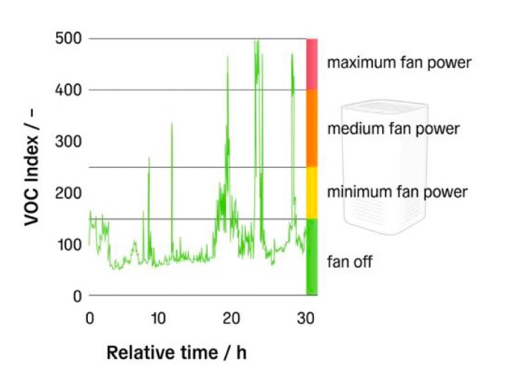
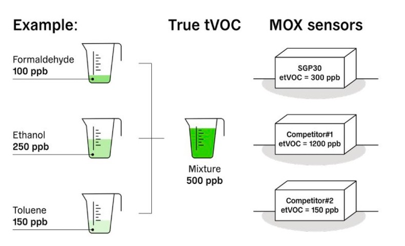
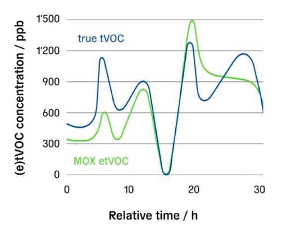
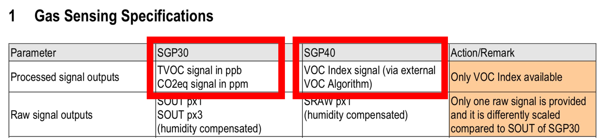
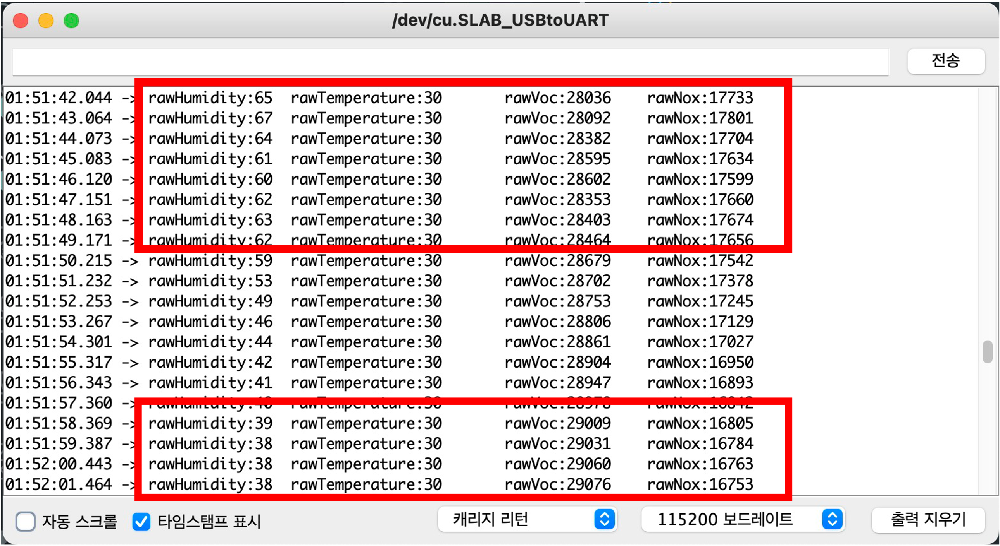
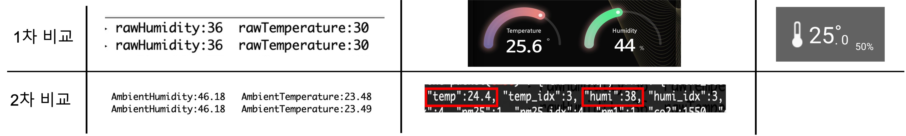
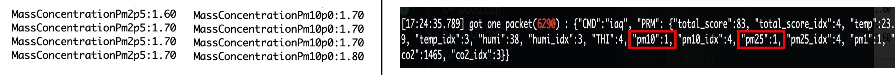

# Sensirion I2C SEN55 Test

# Sensirion I2C SEN5X Arduino Library

https://github.com/Sensirion/arduino-i2c-sen5x

This is the Sensirion SEN5X library for Arduino using the
modules I2C interface.

 

## Supported sensors

- SEN50 (only particulate matter signals available)
- SEN54 (no NOx signal available)
- SEN55 (full feature set)

# Installation

To install, download the latest release as .zip file and add it to your
[Arduino IDE](http://www.arduino.cc/en/main/software) via

	Sketch => Include Library => Add .ZIP Library...

Don't forget to **install the dependencies** listed below the same way via `Add
.ZIP Library`

Note: Installation via the Arduino Library Manager is coming soon.

# Dependencies

* [Sensirion Core](https://github.com/Sensirion/arduino-core)

# Quick Start

1. Connect the SEN5X Sensor to your Arduino board's standard
   I2C bus. Check the pinout of your Arduino board to find the correct pins.
   The pinout of the SEN5X Sensor board can be found in the
   data sheet.

   | *SEN5X* | *Arduino*   | *Jumper Wire* |
   | ------- | ----------- | ------------- |
   | VCC     | 5V          | Red           |
   | GND     | GND         | Black         |
   | SDA     | SDA         | Green         |
   | SCL     | SCL         | Yellow        |
   | SEL     | GND for I2C | Blue          |

   | *Pin* | *Name* | *Description*                   | *Comments*                       |
   | ----- | ------ | ------------------------------- | -------------------------------- |
   | 1     | VCC    | Supply Voltage                  | 5V ±10%                          |
   | 2     | GND    | Ground                          |
   | 3     | SDA    | I2C: Serial data input / output | TTL 5V and LVTTL 3.3V compatible |
   | 4     | SCL    | I2C: Serial clock input         | TTL 5V and LVTTL 3.3V compatible |
   | 5     | SEL    | Interface select                | Pull to GND to select I2C        |
   | 6     | NC     | Do not connect                  |

2. Open the `exampleUsage` sample project within the Arduino IDE

		File => Examples => Sensirion I2C SEN5X => exampleUsage

3. Click the `Upload` button in the Arduino IDE or

		Sketch => Upload

4. When the upload process has finished, open the `Serial Monitor` or `Serial
   Plotter` via the `Tools` menu to observe the measurement values. Note that
   the `Baud Rate` in the corresponding window has to be set to `115200 baud`.

# VOC index

< 

( 위의 그림은 VOC 지수를 통한 공기청정기 동작의 예 )

VOC index가 100을 초과한다는 것은 평균에 비해  VOC가 더 많다는 것을 의미함
( 예: 요리에서 발생하는 VOC 이벤트에 의해 유발됨. 청소, 호흡 등 )
VOC index가 100미만이면 평균에 비해 VOC가 적다는 의미임
(예: 열린 창문의 신선한 공기, 공기청정기 사용 등)
-> 모든 실내 환경 조건에 대해 오프셋이 100으로 매핑되어 있음

 
 

독일 연방 환경청 또는 WHO에서 발표한 건강 관련 실내 공기질 수준은 tVOC를 참조함
이를 정확하게 측정하기 위해서는 수백 개의 VOC를 동시에 개별적으로 정량화 할 수 있어야 함
-> 이러한 장치는 크고 비싸며 실내 공기 품질 모니터 또는 공기 청정기 등의 소비자 제품에 적합하지 않음

따라서 현재 MOX는 반정량적 VOC 표시기로 사용하는 것이 맞음

+ 수증기는 가스로 작용하여 MOS Sensor에 영향을 미침 
  - 습기에 대한 보정이 필요함 ( SGP30 기존 TVOC 경우 )
  - SEN55 SGP40는 on-chip humidity compensation 기능이 있음

# 센서 테스트

## 1. 온/습도, 미세먼지 (1.0/2.5/4.0/10.0), VOC index, Nox index의 Output 확인함

## 2. VOC output을 VOC index가 아닌 ppb로 받고자 함 
### - SEN55 데이터시트 확인 
Output signals : VOC index, NOx Index 
-> Evaluated using the calibration and test sequence according to the application note SGP40 - Testing Guide

### - SGP40(통합 센서)와 SGP30(기존 TVOC) output 비교

### - VOC index to PPB : 두 센서의 Output을 정규화하는 방법이 나와 있지 않다. ( 관련 질문만 있음 )

## 3. VOC index Algorithm의 input data 확인
### - SEN55 library에서 raw value 함수 확인
### - Output으로 Raw value 측정 

# rawValue 확인

입김을 불었을 때 rawVoc output 수치가 28000대로 감소함
일반적으로 29000대를 유지함 
결론 : Raw value 값과 PPB 값을 정규화해야 함  –  rawValue * w = PPB

# 자사의 상용화 제품과 비교

#### 자사의 상용화 제품들의 표출된 측정 값은 펌웨어에서 로직을 통해 정렬 및 평균 다운스케일이 이루어졌지만
#### 원시 데이터에 대해서 동일함

비교한 상용화 제품의 온습도 값은 신뢰성 있음
- SEN55의 기구 디자인 없이 센서 측정 비교 시 온도 약 1도 차이 / 습도 약 12프로 차이 

비교한 상용화 제품의 미세먼지 값은 신뢰성 있음
